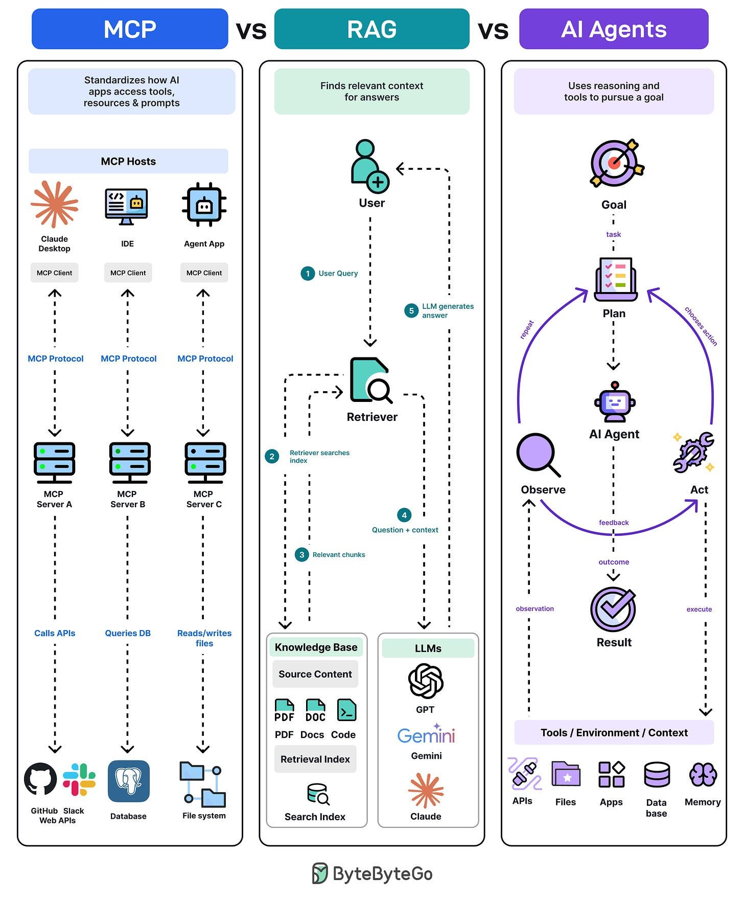

MCP, RAG, and agents are often sold as competing products. They are
three **layers**. MCP is connectivity. RAG is retrieval. An agent is
a control loop. One application can use all three.

The diagram below (ByteByteGo) is the course's reference picture.
Read the three columns left to right: plumbing, then a single
grounded answer, then an iterative worker.

[{#fig-mcp-rag-agents}](https://blog.bytebytego.com/)

## MCP: a standard way to plug tools in {#sec-mcp}

MCP is an open standard protocol. It connects AI models to external
tools and data sources. These can be APIs, databases, or apps like
Gmail, Slack, or GitHub. So instead of you writing the integration
or doing the integration for each of these applications separately,
MCP basically gives you a standard way to connect to these systems.

In @fig-mcp-rag-agents the **host** (Claude Desktop, an IDE, an
agent app) is an MCP **client**. It speaks one protocol to many MCP
**servers**. Each server then does the proprietary work: call
GitHub, query Postgres, read a folder.

That is why MCP shows up in this course after "tool calling" in
Python. A tool is a function plus metadata. MCP is how that function
is **discovered and invoked across process boundaries**, instead of
being hard-wired into one notebook.

See the official specification at
[modelcontextprotocol.io](https://modelcontextprotocol.io/). A
minimal server lives in
[`python/basic-mcp-server/`](../python/basic-mcp-server.qmd).

```{mermaid}
%%| label: fig-mcp-hosts
%%| fig-cap: "One protocol, many servers: hosts stay interchangeable; integrations live behind MCP servers."
%%{init: {'theme': 'sandstone'}}%%
flowchart TD
  H["MCP host: IDE, desktop, agent"] --> C["MCP client"]
  C -->|"MCP protocol"| SA["Server A: APIs"]
  C --> SB["Server B: database"]
  C --> SC["Server C: files"]
```

## RAG: fetch context when the question arrives {#sec-rag}

In RAG, the model pulls the fresh information when a query comes.
And this is why the model does not have to make stuff up on its own,
but instead it fetches the fresh information from external data
sources, like docs, PDFs, and databases, to give the most up-to-date
answer to the prompt.

The numbered path in the middle of @fig-mcp-rag-agents is a
**request–response** pipeline:

1. The user asks a question.
2. A retriever searches an index (embeddings, lexical search, or both).
3. Relevant **chunks** come back from the knowledge base.
4. Question plus chunks go to the LLM.
5. The LLM writes an answer grounded in that context.

RAG does not, by itself, let the model send an email or delete a
file. It changes **what is in the prompt**. If the index is stale,
the answer is stale. If retrieval misses the right passage, the
model may still invent a fluent gap-filler — which is why citations
and chunk inspection belong in any serious RAG lab.

## Agents: pursue a goal, not a single reply {#sec-agents}

An AI agent is kind of an AI system where the agent performs the
task autonomously and takes the decisions. And then making sure
everything is working fine, instead of a chatbot, which is really a
request-response.

The right-hand column of @fig-mcp-rag-agents is a loop: **goal →
plan → act → observe → re-plan**, until a stopping condition. The
"act" step is tool use against APIs, files, apps, databases, or
memory.

Hadley Wickham's one-line definition is enough for the R lab: an
agent is a chatbot with at least one **read** tool and one **write**
tool ([A no bullshit guide to LLMs](https://tidydesign.substack.com/p/a-no-bullshit-guide-to-llms)).
Listing files then deleting CSVs is already an agent — and already a
security problem. Treat "YOLO" file deletion as a teaching example,
not a production pattern.

```{mermaid}
%%| label: fig-agent-loop
%%| fig-cap: "Agent control loop: choose an action, observe the environment, update the plan."
%%{init: {'theme': 'sandstone'}}%%
flowchart LR
  G["Goal"] --> P["Plan"]
  P --> A["Act with tools"]
  A --> O["Observe"]
  O --> R{"Done?"}
  R -->|no| P
  R -->|yes| X["Result"]
```

## How to choose {#sec-choose}

| Need | Pattern |
|------|---------|
| The answer lives in *your* documents | RAG |
| The model must call *many* existing apps | MCP (or equivalent tool gateway) |
| The task needs several steps and checks | Agent loop |
| One shot: classify, extract, rewrite | Plain chat (maybe structured output) |

Compose rather than pick a camp. A coding agent in Cursor is an
agent host that speaks MCP to servers; it may also RAG over the
repository. A RAG chatbot with no tools is still just
request–response.

The Python chapters implement a **tool** and an **MCP server**. The
R chapter implements the same ideas inside `ellmer`.
