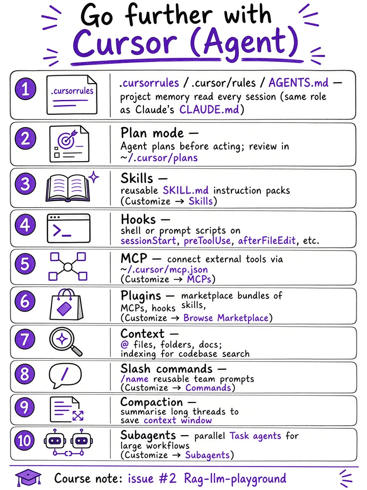
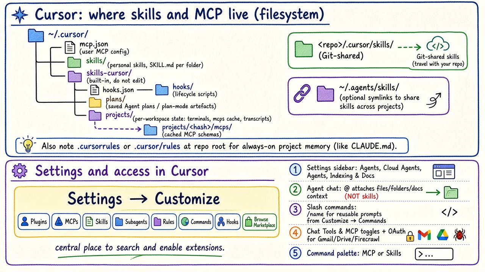
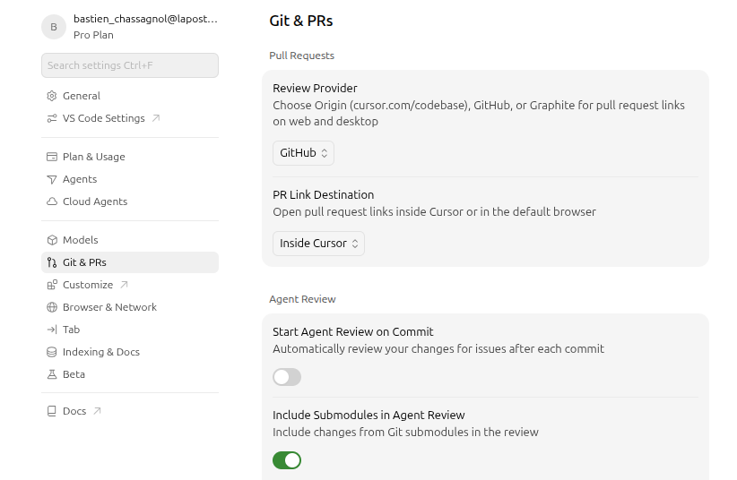
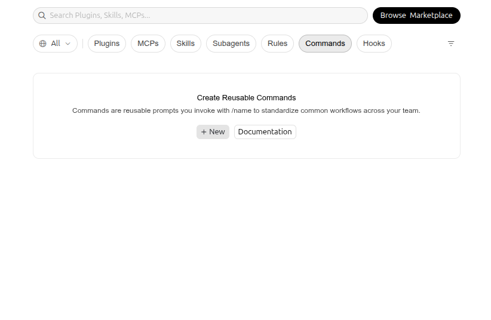
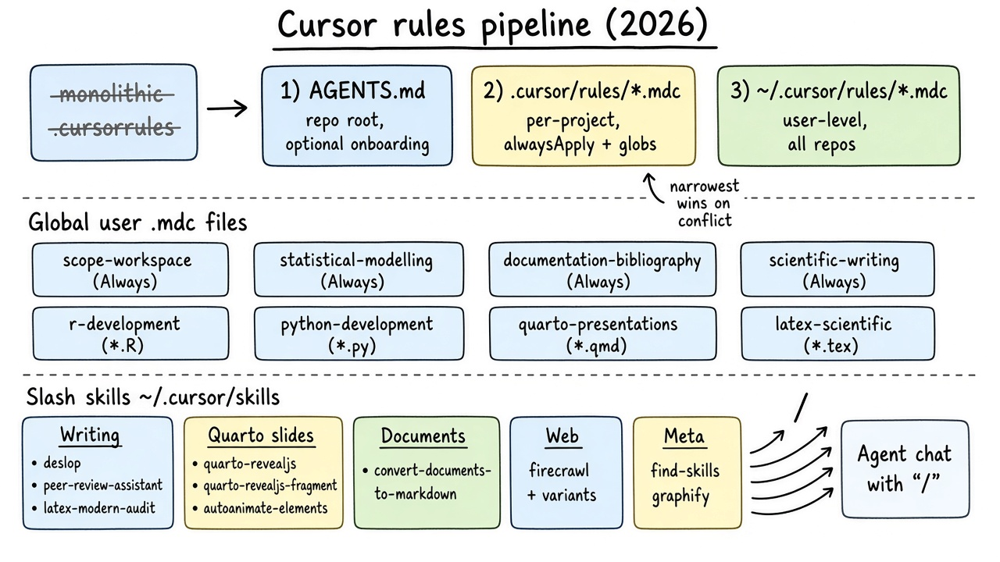
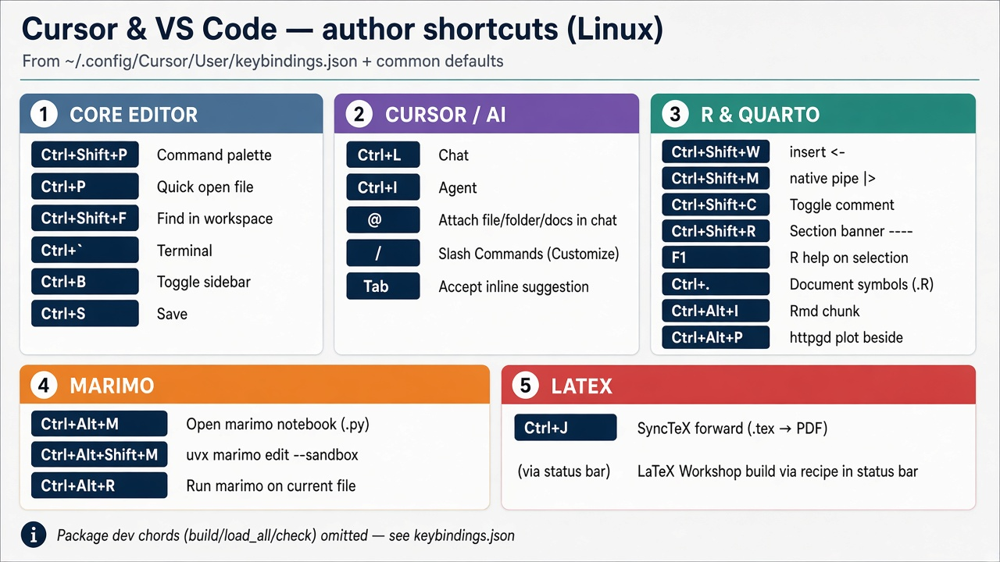

This chapter is about **hosted** assistants you already have in a
browser: ChatGPT's companion products, a short list of GPTs, and
reusable **skills**. It is complementary to [MCP, RAG, and
agents](../theory/tools-vs-agents.qmd), where you build the plumbing
yourself.

The GPT Store catalogue changes often. Treat @tbl-gpts as a 2026
shortlist for a biostatistician or data scientist, not as a ranking
that will still be true next term. Browse the live list at
[chatgpt.com/gpts](https://chatgpt.com/gpts).

## Companion ChatGPT tools {#sec-chatgpt-companions}

OpenAI now ships several **first-party** surfaces beside ordinary
chat. Three that matter for this course:

**Explore / GPTs.** Custom chatbots with a saved system prompt,
optional file knowledge, and optional actions. Anyone can publish a
GPT to the store; Plus (and higher) can use other people's GPTs
inside ChatGPT. A GPT is a *configured model*, not a new architecture.
It does not replace RAG or MCP; it is one place to attach them.

**Images.** Native image generation and editing in ChatGPT
([Images 2.5](https://openai.com/index/introducing-chatgpt-images-2-5/),
2026). Templates, sketch-to-image, and in-place comments replace the
old official DALL·E GPT, which OpenAI retired. Useful for lecture
figures and poster drafts; still a poor source of *data-accurate*
plots (axes lie, samples invent themselves).

**Sites.** [ChatGPT Sites](https://help.openai.com/en/articles/6825453-chatgpt-release-notes.html)
(public beta) turns a chat into a small interactive website or
dashboard you can preview and share without leaving ChatGPT. Fine for
a course demo or an internal tracker; not a substitute for a
version-controlled Quarto book.

Other first-party pieces worth knowing, even if they are not GPTs:
**Projects** (sticky files and instructions), **Deep research**
(long cited reports), **search** across chats, **writing blocks** and
**code blocks** (the 2026 replacement for Canvas on current models;
see @sec-gpts), and **voice**. None of these require you to host a
server.

## Ten GPTs for this audience {#sec-gpts}

Selection criteria: documented in the GPT Store or OpenAI's own
product, and useful for **academic or industrial** data work,
**visualisation** (plots, slides, posters), or **teaching**. Cap of
ten. Canvas is included because it is still the name people search
for, with a note on what replaced it.

| GPT | Role | Main pros | Main cons |
|-----|------|-----------|-----------|
| Canvas (OpenAI; now writing / code blocks) | Side-by-side draft of text or code | Fast iteration on a manuscript or script; versioned edits in one pane | Removed from GPT-5.5 Instant/Thinking (May 2026); paid users only on legacy models for a while; easy to skip Git |
| AskYourPDF Research Assistant | Chat over uploaded PDFs and a paper index | Citations and summaries from *your* files; also a standalone site | Plus needed in ChatGPT; PDF OCR and table extraction remain noisy |
| Consensus | Question → papers (large scholarly index) | Yes/no evidence summaries; better than unsourced chat for "does X work?" | Coverage and study quality vary; not a systematic review |
| SciSpace (ResearchGPT) | Read and explain papers in place | Strong on terminology and follow-up on a PDF | Easy to over-trust paraphrases of methods |
| Scholar GPT | Literature synthesis and citation formats | Convenient APA/MLA dumps for teaching handouts | Same hallucination risk as any LLM unless it actually queried a database |
| Wolfram | Symbolic maths, units, curated data | Exact computation where ChatGPT would guess | Steeper prompts; not a substitute for a statistical model of *your* trial |
| Data Analyst (OpenAI) | Upload CSV/Excel; Python in a sandbox; charts | The right default for a first look at a table | Sandbox is not your lab; do not upload identifiable patient data |
| Canva | Layouts: slides, posters, social graphics | Templates beat starting from a blank page | Design language is marketing-first; figures still need real data |
| Diagrams: Show Me | Flowcharts and architecture sketches | Quick Mermaid-like diagrams for lectures | Layouts drift; export and accessibility are weak |
| Tutor Me (Khan Academy) | Socratic explanation for students | Good for office-hours style walkthroughs | Can skip the derivation you actually wanted; check against the syllabus |

: Ten GPTs (or first-party stand-ins) for data science, visualisation, and teaching. Confirm names in the [GPT Store](https://chatgpt.com/gpts). {#tbl-gpts}

**Canvas, specifically.** Open it historically with "use canvas" or
the composer tool. From May 2026, current GPT-5.5 chat models use
**writing blocks** and **code blocks** in the thread instead
([release notes](https://help.openai.com/en/articles/6825453-chatgpt-release-notes.html)).
For this course, treat "Canvas GPT" as: *a durable artefact beside
the chat*, not as a guaranteed menu item.

**AskYourPDF.** Upload a protocol or a paper, then ask for a
structured summary. Pair it with the frozen prompt in
[`config/prompts/mathematical-researcher.md`](../config/prompts/mathematical-researcher.md)
when the task is a derivation, not a PDF.

Industrial versus academic use of the same GPT differs mainly in
**data governance**: a CRO or hospital should not paste trial
listings into a consumer GPT. Use an enterprise workspace, or keep
the file on-prem and call an API under contract.

## Skills: invoke with `$` {#sec-skills}

GPTs are *products in the store*. **Skills** are *local instruction
packs* (Markdown plus optional scripts) that ChatGPT, Codex, and
Cursor can load on demand. OpenAI's pattern
([Build skills](https://learn.chatgpt.com/docs/build-skills)):

- In **Codex**, type `$` then the skill name (for example
  `$maths-dollar`).
- In **ChatGPT**, type `@` to attach a skill.
- In **Cursor**, skills are enabled under **Customize**; chat **@**
  adds files and docs, not skills (see @sec-cursor-settings).
- The model may also pick a skill when the user request matches the
  `description` field.

This repository keeps course skills under `config/skills/`. The first
one is **maths-dollar**: force `$…$` / `$$…$$` LaTeX, define symbols,
and refuse to skip the exact problem. Copy the folder into Cursor
(`.cursor/skills/`) or Codex as needed.

```bash
# Codex / Cursor-style explicit call
$maths-dollar
Prove that the ALR covariance is singular, then give a rank.
```

A skill is not MCP. MCP exposes tools; a skill tells the model *how*
to use language, maths, or those tools. You can combine both.

## Cursor: skills, MCP, and settings {#sec-cursor}

[Cursor](https://cursor.com/) is the IDE many of you already use for
this course. It shares the *ideas* behind ChatGPT skills and Claude
Code extensions, but paths, toggles, and chat affordances differ.
@fig-cursor-capabilities is a Cursor-oriented map of those features
(compare the Claude Code checklist in
[issue #2](https://github.com/bastienchassagnol/Rag-llm-playground/issues/2);
permissions and checkpoint policies are omitted here because Cursor
handles them differently).

{#fig-cursor-capabilities width="55%"}

**Project memory.** In Claude Code, `CLAUDE.md` is read at the start of
every session. In Cursor, a single monolithic **`.cursorrules`** file
still works, but maintainable setups split conventions across three
locations (see @sec-cursor-rules-pipeline): optional **`AGENTS.md`**
onboarding at the repo root, **`.cursor/rules/*.mdc`** for project
rules (highest precedence on conflicts), and **`~/.cursor/rules/*.mdc`**
for cross-repo programming and scientific-writing defaults. Rules are
always-on; they are not skill packs.

**Plan mode.** Agent can draft a plan before editing files; artefacts
often land under `~/.cursor/plans/` for review.

**Skills, hooks, MCP, plugins.** Instruction files (`SKILL.md`),
lifecycle scripts (`hooks.json`), remote tools (`mcp.json`), and
marketplace **plugins** that bundle several of the above. Browse and
enable them from **Settings → Customize** (@fig-cursor-customize).

**Context.** **@** in chat attaches **files, folders, documentation,
or symbols** — context for the model, not a skill selector. Indexing
for the codebase lives under **Settings → Indexing & Docs**.

**Slash commands.** **/** plus a name runs a **Command** (reusable
prompt) defined under Customize → Commands — distinct from skills.

**Compaction and subagents.** Long threads can be summarised to save
tokens; **Subagents** (parallel Task workers) are configured under
Customize → Subagents.

@fig-cursor-skills-mcp summarises on-disk layout and UI entry points.
Screenshots: sidebar (@fig-cursor-settings-sidebar) and Customize
(@fig-cursor-customize).

{#fig-cursor-skills-mcp width="90%"}

{#fig-cursor-settings-sidebar width="70%"}

{#fig-cursor-customize width="85%"}

### Where files live {#sec-cursor-paths}

| Location | Scope | Contents |
|----------|-------|----------|
| `~/.cursor/skills/<name>/SKILL.md` | Personal | Your Agent Skills (all projects) |
| `<repo>/.cursor/skills/<name>/` | Project | Skills committed with the repository |
| `~/.cursor/skills-cursor/` | Built-in | Cursor-managed skills; do not edit |
| `~/.cursor/mcp.json` | Personal | MCP server definitions (`mcpServers`) |
| `~/.cursor/hooks.json`, `~/.cursor/hooks/` | Personal or project | Lifecycle hook scripts (see @sec-cursor-hooks) |
| `~/.cursor/plans/` | Personal | Saved Agent plans and plan-mode outputs |
| `~/.cursor/projects/` | Personal | Per-workspace state (terminals, transcripts, caches) |
| `~/.cursor/projects/<hash>/mcps/` | Cache | Per-workspace MCP tool metadata (local only) |
| `<repo>/.cursorrules` | Project | Legacy single-file rules (prefer `.mdc` split) |
| `<repo>/.cursor/rules/*.mdc` | Project | Scoped rules (`alwaysApply` or `globs`) |
| `<repo>/AGENTS.md` | Project | Optional repo onboarding for agents |
| `~/.cursor/rules/*.mdc` | User | Global rules (all repositories) |
| `~/.agents/skills/` / `~/.claude/skills/` | Optional | Extra skill packs; often symlinked into `~/.cursor/skills/` |

Project skills in `.cursor/skills/` travel with Git. **Rules** and
**skills** are different layers: rules load every turn; skills load
when the task matches their `description` or when you enable them in
Customize.

### Rules pipeline and global `.mdc` files {#sec-cursor-rules-pipeline}

@fig-cursor-rules-pipeline summarises how to layer **rules** in a
modern Cursor workflow. The sketch is AI-generated in an Excalidraw-like
style for teaching; the tables below are the canonical text.

{#fig-cursor-rules-pipeline width="100%"}

**Top — where rules live (precedence increases toward the repo).**

1. **`~/.cursor/rules/*.mdc`** — user-wide defaults (British English,
   statistics, Zotero hygiene, R/Python/Quarto/LaTeX conventions).
2. **`<repo>/.cursor/rules/*.mdc`** — project overrides (`alwaysApply:
   true` or file `globs` such as `**/*.R`).
3. **`<repo>/AGENTS.md`** — optional one-page agent onboarding (commands,
   data layout, check targets); does not replace scoped `.mdc` rules.
4. **`<repo>/.cursorrules`** — still honoured, but hard to diff and easy
   to bloat; migrate durable sections into `.mdc` files.

**Middle — global user rules on this machine** (`~/.cursor/rules/`):

| File | Scope |
|------|--------|
| `scope-workspace.mdc` | Always — scope, data discipline, SSH/editor hosts |
| `statistical-modelling.mdc` | Always — CV, bootstrap, permutation, model review |
| `documentation-bibliography.mdc` | Always — Zotero, Quarto bib, document intake |
| `scientific-writing.mdc` | Always — voice, figures, integrity, reporting |
| `r-development.mdc` | `*.R`, package layout — CRAN hygiene, Air, ggplot2 |
| `python-development.mdc` | `*.py`, `pyproject.toml` — uv, Ruff, ty |
| `quarto-presentations.mdc` | `*.qmd`, slides — Quarto, Mermaid, reveal.js |
| `latex-scientific.mdc` | `*.tex`, article trees — LuaLaTeX, TikZ, minted |

**Bottom — slash skills** (`~/.cursor/skills/<name>/SKILL.md`). Type
**/** in Agent chat to run a saved **Command**, or name a skill so the
Agent loads it when the `description` matches. Families on this machine:

| Domain | Skills (invoke by folder name) |
|--------|--------------------------------|
| Writing and review | `deslop`, `peer-review-assistant`, `latex-modern-audit` |
| Authoring and decks | `quarto-revealjs`, `quarto-revealjs-fragment`, `auto-animate-elements`, `convert-documents-to-markdown` |
| Code intelligence | `graphify`, `find-skills` |
| Web and literature (Firecrawl) | `firecrawl` (router) plus specialised skills (`firecrawl-scrape`, `firecrawl-search`, `firecrawl-research-papers`, `firecrawl-parse`, …) |
| Social / misc. | `instagram-carousel` |

Full inventory: @tbl-cursor-skills and
[`tools/data/cursor_skills_inventory.csv`](data/cursor_skills_inventory.csv).
Built-in Cursor skills remain under `~/.cursor/skills-cursor/` (not
listed here).

### Settings and access {#sec-cursor-settings}

1. **Settings → Customize** — primary UI for **Plugins**, **MCPs**,
   **Skills**, **Subagents**, **Rules**, **Commands**, and **Hooks**;
   use **Browse Marketplace** to install bundles.
2. **`~/.cursor/mcp.json`** — edit directly or via Customize → MCPs;
   set env vars (for example `FIRECRAWL_API_KEY`) before connecting.
3. **Settings → Agents / Cloud Agents** — model and agent behaviour for
   local versus cloud workers.
4. **Agent chat** — **@** for files, folders, and docs; **/** for
   saved Commands; let skills match from their description or pick
   them in Customize (not via `@`).
5. **Chat → Tools & MCP** — toggle MCP namespaces per thread; complete
   OAuth for Gmail, Google Drive, and similar plugins.
6. **Command palette** (`Ctrl+Shift+P`) — jump to MCP or skill settings.

Install skill packs with `npx skills add <publisher/repo>`, then reload
the window so folders appear under `~/.cursor/skills/`.

### Hooks for biostatistics and computational biology {#sec-cursor-hooks}

**Hooks** run shell or prompt checks on Agent lifecycle events
(`sessionStart`, `beforeSubmitPrompt`, `preToolUse`, `afterFileEdit`,
`beforeShellExecution`, and others). For a wet-lab or trials-aware
workflow, a **project** hook set in `.cursor/hooks.json` might:

- **`beforeSubmitPrompt`** — reject prompts that paste raw patient
  identifiers, unredacted trial listings, or credentials; return a
  short reminder to use synthetic or approved sandbox data.
- **`beforeShellExecution`** — allow `Rscript`, `quarto`, `nextflow`,
  and `uv run`; block `rm -rf`, writes outside the repo, or
  `curl` uploads to unknown hosts.
- **`afterFileEdit`** on `R/**/*.R` — run `air format` or `lintr` and
  surface diagnostics in the hook response (fail open if the linter is
  missing, so teaching laptops still work).
- **`sessionStart`** — print one line: restore `renv`, confirm
  `ANTHROPIC_API_KEY` or enterprise endpoint, and point to
  `data/raw/` (read-only) versus `output/`.
- **`beforeMCPExecution`** — log which external MCP ran (audit trail
  for Firecrawl or Gmail) without blocking, unless the server is
  disabled in Customize.

Hooks complement **rules**: rules teach the model; hooks enforce or
audit what actually runs. See Cursor's hook schema in the built-in
`create-hook` skill under `~/.cursor/skills-cursor/`.

### Example subagent designs (text only) {#sec-cursor-subagents}

Subagents are not checked into this repository; the three briefs below
are **configuration sketches** you could implement under Customize →
Subagents or via the Task tool with tailored prompts.

**i) Single-cell and spatial atlas builder.** Objective: integrate
scRNA-seq, spatial transcriptomics, and imaging into a reproducible
atlas. **Tools:** read/write repo; MCP to GitHub and literature
(Firecrawl research index); shell for **Python** (`scanpy`, `squidpy`),
**R** (`Seurat`, `Banksy`), and **Nextflow** (`nf-core/scrnaseq`,
custom spatial modules). **Policy:** never commit raw patient matrices;
write only under `data/processed/` and `output/`; pin seeds and
software versions in a `samplesheet.csv`. **Stop when:** QC report,
annotated `AnnData`/`Seurat` objects, and a Quarto methods appendix
exist.

**ii) Python data-science product repo.** Objective: maintain a
`uv`-managed package with tests and CI. **Tools:** terminal, linter
MCP optional, GitHub MCP for PRs. **Policy:** `ruff format` after edits;
no `pip install` in library code; tests under `tests/` with
`pytest -q`. **Stop when:** feature branch passes `uv run pytest` and
`ty check`.

**iii) New R statistical software.** Objective: ship an CRAN-ready
package with roxygen, testthat, and pkgdown. **Tools:** shell for
`devtools::check()`, `pkgcheck::pkgcheck()`, `quarto render`; no
network except documented dependencies. **Policy:** British English in
docs; ASCII-only `R/`; examples use `withr::local_tempdir()`; follow
house `.cursorrules`. **Stop when:** `R CMD check` is clean and NEWS
documents the user-visible API.

### MCP and built-in skills (snapshot) {#sec-cursor-mcp-builtin}

September 2026 on the author's machine:

| Namespace | Role |
|-----------|------|
| `user-firecrawl` | Scrape, search, papers (`~/.cursor/mcp.json`) |
| `plugin-gmail-gmail` | Gmail (plugin; OAuth) |
| `plugin-google-drive-google-drive` | Drive (plugin; OAuth) |
| `cursor` | Built-in Agent tools (terminal, Task, and others) |

**Built-in skills** (`~/.cursor/skills-cursor/`): automate, autopilot,
canvas, create-hook, create-rule, create-skill, create-subagent,
goal, loop, migrate-to-skills, new-repo, onboard, origin, rename-chat,
review, review-bugbot, review-security, sdk, share, shell, split-to-prs,
statusline, update-cli-config, update-cursor-settings.

### Personal skills under `~/.cursor/skills/` {#sec-cursor-inventory}

@tbl-cursor-skills groups **38** skills visible in Customize on this
machine (mostly Firecrawl, plus writing/review helpers). Edit
[`tools/data/cursor_skills_inventory.csv`](data/cursor_skills_inventory.csv)
when you add skills.

```{r}
#| label: tbl-cursor-skills
#| eval: true
#| tbl-cap: "Personal Cursor skills on the author's machine, grouped by family."
#| tbl-pos: "H"
#| message: false
#| warning: false

if (!requireNamespace("tinytable", quietly = TRUE)) {
  stop(
    "Install tinytable to render this table: ",
    "install.packages('tinytable').",
    call. = FALSE
  )
}
csv <- "tools/data/cursor_skills_inventory.csv"
if (!file.exists(csv)) {
  csv <- "data/cursor_skills_inventory.csv"
}
d <- read.csv(csv, stringsAsFactors = FALSE)
d <- d[order(d$family, d$skill), ]
rle <- rle(d$family)
starts <- cumsum(c(1L, head(rle$lengths, -1L)))
idx <- setNames(as.list(starts), rle$values)
tab <- tinytable::tt(d[, c("skill", "role")])
tinytable::group_tt(tab, i = idx)
```

### Keyboard shortcuts (this machine) {#sec-cursor-keybindings}

Cursor inherits most **VS Code** defaults on Linux; the bindings below
are the **custom** ones in
`~/.config/Cursor/User/keybindings.json`, plus a few defaults every
author uses daily. @fig-cursor-keybindings-cheatsheet is a printable
layout (RStudio-cheatsheet style). Package-development chords
(`devtools::build`, `load_all`, document/test/check tasks) are
omitted here — they remain in the JSON file.

{#fig-cursor-keybindings-cheatsheet width="95%"}

| Area | Shortcut | Action |
|------|----------|--------|
| Core | `Ctrl+Shift+P` | Command palette |
| Core | `Ctrl+P` | Quick open file |
| Core | `Ctrl+Shift+F` | Find in workspace (bound in JSON) |
| Core | `` Ctrl+` `` | Toggle terminal |
| Core | `Ctrl+B` | Toggle sidebar |
| Cursor | `Ctrl+L` | Open chat |
| Cursor | `Ctrl+I` | Agent / composer |
| Cursor | `@` | Attach file, folder, or docs in chat |
| Cursor | `/` | Run a saved **Command** (Customize) |
| R / Quarto | `Ctrl+Shift+W` | Insert `<-` |
| R / Quarto | `Ctrl+Shift+M` | Insert native pipe (`|>`) |
| R / Quarto | `Ctrl+Shift+C` | Toggle line comment |
| R / Quarto | `Ctrl+Shift+R` | Insert `# Section ----` banner |
| R / Quarto | `F1` | R help for selection |
| R / Quarto | `Ctrl+.` | Document symbols (`.R`) |
| R / Quarto | `Ctrl+Alt+I` | Insert `{r}` chunk (`.Rmd`) |
| R / Quarto | `Ctrl+Alt+P` | Open **httpgd** plot beside editor |
| Marimo | `Ctrl+Alt+M` | Open marimo notebook (`.py`) |
| Marimo | `Ctrl+Alt+Shift+M` | `uvx marimo edit --sandbox` in terminal |
| Marimo | `Ctrl+Alt+R` | `uvx marimo run` current `.py` file |
| LaTeX | `Ctrl+J` | SyncTeX forward (`.tex` → PDF viewer) |

Copy course skills from `config/skills/` into `.cursor/skills/` when
you want the same maths or marking behaviour in the IDE as in ChatGPT
(see @sec-skills).

## Other options worth a mention {#sec-other}

- **Build your own GPT** when the same lab brief repeats weekly
  (marking rubric, package house style).
- **Elicit**, **NotebookLM**, and publisher sites: often better
  literature workflows than a random store GPT; they are not in
  @tbl-gpts because they are not ChatGPT GPTs.
- **Claude Projects**, **Gemini Gems**, **Copilot** in the IDE:
  the same "sticky instructions + files" idea on another host.
- **MCP servers** in Cursor (this book's Python lab): when the tool
  must see *your* GitHub, Gmail, or database, not a GPT author's
  action URL.

For anything that will be marked or published, keep the source of
truth in Git (this book, `config/prompts/`, package vignettes), not
in a chat transcript.
